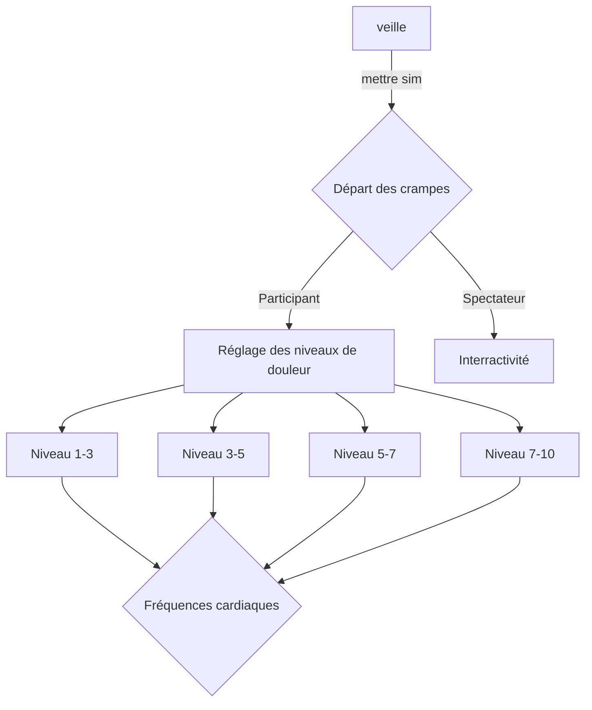

# Ruine

## Idée
- Donner une environnement compétitif?
- Donner du travail à faire ?
- Calculer le temps total pour supporter ?
- Calculer les fréquences cardiaques ?
- Projections d'environnements ?
- Donner les spectateurs une interractivité (avoir contrôle du level de douleur ?)

### Concept

Une personne est connectée à un simulateur de crampes menstruelles et un capteur de fréquences cardiaque. La douleur reçu va venir changer l'environnement du participant tout selon sa fréquence cardiaque. Les designs graphiques projetés sur le mur, les couleurs et les mouvements sont modifiés tout dépendant des fréquences détectés. Les sons se déforment et se modifis tout selon ce que ressent la personne qui reçoit les légères douleurs. Ce qui rend le tout intéressent c'est que toute personne recevant les douleurs peut réagir différemment et donc intéragir avec la pièce de manière unique, bien sûr, avec certaines limites. De plus, les participants extérieurs (n'aillant pas le simulateur) pourraient ajuster l’intensité des sons émits dans l'entourage via un capteur de mouvement, ce qui rajoute du chaos à l'oeuvre. Cela mettrait en lumière l’idée que les douleurs menstruelles sont parfois mal comprises et incontrollables. Le tout deviendra un environnement pour y faire comprendre l'impact nerveux. EN TOUT TEMPS, la personne recevant les crampes pourra arrêter la simulation. Seulement, son temps, son niveau atteint sera compté et inscrit.

### Objectifs

Le but est de faire comprendre à chaque personnes ce qu'une personne **peut concevoir sensoriellement** la douleur menstruelle à chaque mois. **Placer quelqu'un n'aillant pas de crampes à la place de celle, ou celui, qui en a** à chaque mois et qui doit gérer sa vie en conséquence. **Ouvrir la parole sur un sujet qui est tabou.**

### Motivations

Ma vie personelle, les histoires d'autres personnes vivant avec les mêmes problèmes. Les sensations ressentis. Après avoir regardé des vidéos de personnes testant des simulateurs de crampes, l'inspiration m'est venue d'utiliser cette technologie. ??????

## Scénario

https://github.blog/developer-skills/github/include-diagrams-markdown-files-mermaid/

## Ambiance

### Planche d'ambiances visuelles

Exemples de projets similaires

### Planche d'ambiances sonores

Planche d'ambiance

### Références artistiques

Oeuvres inspirantes.

## Technologies

### Support médiatique

Vidéo, audio, sensoriel interactif ?

### Matériel

Simulateur de crampes, capteur de fréquences cardiaques, stéréos, projecteur, lumières, cables, une salle, chaise au besoin, clavier et ordi ? timer ? bouton angle pour lvl de douleur ?.

### Logiciels

Arduino, Touch Designer, Reaper, Logic Pro, Max, (Unity, blender si 3D) ??

## sources

https://www.serwah.xyz/digital-art
https://www.instagram.com/pierrepauze/
https://www.thelisapark.com/work/eunoia
https://www.lozano-hemmer.com/pulse_island.php
https://www.instagram.com/_ng_v/
https://ocula.com/magazine/insights/pain-and-peace-in-michele-chus-installation-art/
https://www.wikiart.org/fr/marina-abramovic
https://fisheyeimmersive.com/article/art-numerique-quand-les-femmes-questionnent-le-sexe/
https://www.ada-x.org/activities/les-larmes-evaporees-des-roses-de-sable-rihab-essayh/
https://www.ada-x.org/activities/htmlles-2024-les-mouvements-qui-nous-sommes-giv/
https://katherinemelancon.com/new-work/
https://htmlles.net/
https://htmlles.net/calendrier/a-nos-protheses/
https://www.ada-x.org/activities/exposition-lorraine-oades/

https://www.youtube.com/watch?v=yQ3vqfdIToo&list=PLUFYSjzJt4pSAkPLRojNrTt6ZOVkDmI2_&index=35
https://www.ada-x.org/activities/unfolding-sequences-ima-pico/
https://www.youtube.com/results?search_query=how+to+use+period+cramp+simulator

https://www.ada-x.org/productions/festival/page/2/
