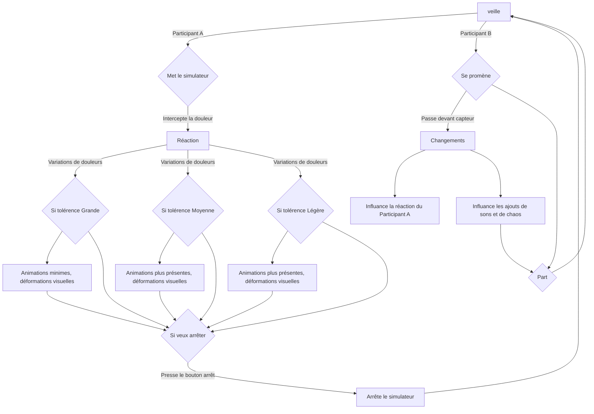

# Ruine

## Idée

### Concept

Une personne est connectée à un simulateur de crampes menstruelles et un capteur de fréquences cardiaque. La douleur reçu va venir changer l'environnement du participant tout selon sa fréquence cardiaque. Les designs graphiques projetés sur le mur, les couleurs et les mouvements sont modifiés tout dépendant des fréquences détectés. Les sons se déforment et se modifis tout selon ce que ressent la personne qui reçoit les légères douleurs. Ce qui rend le tout intéressent c'est que toute personne recevant les douleurs peut réagir différemment et donc intéragir avec la pièce de manière unique, bien sûr, avec certaines limites. De plus, les participants extérieurs (n'aillant pas le simulateur) pourraient avoir contrôle des sons ambiants via un capteur de mouvement, ce qui rajoute du chaos à l'oeuvre. Cela mettrait en lumière l’idée que les douleurs menstruelles sont parfois mal comprises et incontrollables. Le tout deviendra un environnement pour y faire comprendre l'impact nerveux. À tout moment, la personne recevant les crampes pourra arrêter la simulation.

### Objectifs

Le but est de faire comprendre ce qu'une personne **peut ressentir**  autant **physiquement** que **mentalement** en recevant des douleurs menstruelle à chaque mois en **plaçant quelqu'un n'aillant pas de crampes à la place de celle, ou celui, qui en a** à chaque mois et qui doit gérer sa vie en conséquence. Aussi, **ouvrir la parole sur un sujet qui serait tabou.**

### Motivations

- Mon expérience personnelle et celle de mon entourage.
- Le mouvement féministe.
- Le manque d'oeuvres interactives au mouvement féministe (Un domaine majoritèrement homme)
- [Ada x](https://www.ada-x.org/):

>*"Ada X est un centre d’artistes féministe bilingue engagé dans l’exploration, la création et la réflexion critique en arts médiatiques et en culture numérique."*

## Scénario

- Note participant B: Plus il y a de participants B, plus il y a de chaos.

## Ambiance

### Planche d'ambiances visuelles

### Planche d'ambiances sonores

#### Musique:
- https://www.youtube.com/watch?v=UdKfehqXZc0
- https://www.youtube.com/watch?v=4XeSs9a1rLQ&list=PLBBz6wzKh2tMFQ-kCNZKN96oCJCIcehtk
- https://www.youtube.com/watch?v=Tu0psLnYyW4&list=PLBBz6wzKh2tMFQ-kCNZKN96oCJCIcehtk&index=7
- https://www.youtube.com/watch?v=d7vyEsxvKpQ&list=PLBBz6wzKh2tMFQ-kCNZKN96oCJCIcehtk&index=10
- https://www.youtube.com/watch?v=50UKqoiqf3k&list=PLBBz6wzKh2tMFQ-kCNZKN96oCJCIcehtk&index=11
- https://www.youtube.com/watch?v=3w7ay5LPtOY&list=PLBBz6wzKh2tMFQ-kCNZKN96oCJCIcehtk&index=12

### Références artistiques

#### Exemples d'oeuvres inspirantes faites par des femmes:

- **[Eunoia](https://www.thelisapark.com/work/eunoia)** de [Lisa Park](https://www.thelisapark.com/)

- **[I dream of a soft oasis](https://www.rihabessayh.com/i-dream-of-a-soft-oasis-2022)** de [Rihab Essayh](https://www.rihabessayh.com/)

- **[Freeing the Voice](https://imma.ie/collection/freeing-the-voice/)** de [Marina Abramović](https://fr.wikipedia.org/wiki/Marina_Abramovi%C4%87)

#### Liens d'autres oeuvres multimédias servant d'inspirations au projet:

- [Machine hallucinations](https://refikanadol.com/works/machine-hallucinations-nature-dreams/) de Refik Anadol
- [Body Sculptures](https://clotmag.com/body-sculptures/stelarc) de STELARC
- [PainStation](https://www.youtube.com/watch?v=qMie0he1H7s) de Volker Morawe et Tilman Reiff
- [Pulse Room](https://www.lozano-hemmer.com/pulse_room.php) de Rafael Lozano-Hemmer
- [Heavy Duty Love for Future Sensitive Humans](https://www.ngv.vic.gov.au/exhibition/lucy-mcrae/) de Lucy McRae
- [Infinity Room](https://refikanadol.com/works/infinity-room/) de Refik Anadol
- [Universe of Fire Particles Falling from the Sky](https://www.teamlab.art/ew/universe_fireparticles_falling/planets/) de Teamlab
- [TOUCH](https://studioroosegaarde.net/project/touch) de Studio Roosegaarde
- [PSYCH.E](https://en.36degres.art/psych-e) exposition expérience mise en place par 36 degrés et la Galerie Charlot

## Technologies

### Support médiatique

- Vidéos interactives, particules 3D de TouchDesigner, modifications à partir des fréquences cardiaques.
- Interactivité sonore, ambiances stéréos, modification à l'aide de capteurs.

### Matériel
- Simulateur de muscles TENS

- Capteur de fréquences cardiaques

- Speakers
- Projecteurs
- Lumières
- Bouton
- Cables
- Ordinateur portable
- Chaise
- Une salle

### Logiciels

|Arduino|TouchDesigner|Reaper|Logic Pro|
|----|----|----|----|
|||||

## Sources

### Recherches:
- https://www.serwah.xyz/digital-art
- https://www.thelisapark.com/work/eunoia
- https://www.thelisapark.com/
- https://www.lozano-hemmer.com/pulse_island.php
- https://www.wikiart.org/fr/marina-abramovic
- https://imma.ie/collection/freeing-the-voice/
- https://fisheyeimmersive.com/article/art-numerique-quand-les-femmes-questionnent-le-sexe/
- https://www.ada-x.org/
- https://htmlles.net/
- https://www.ada-x.org/activities/exposition-lorraine-oades/
- https://www.ada-x.org/activities/unfolding-sequences-ima-pico/
- https://www.ada-x.org/activities/pas-dapparat-corps/
- https://www.ada-x.org/activities/les-larmes-evaporees-des-roses-de-sable-rihab-essayh/

### Vidéos:

- https://www.youtube.com/watch?v=UdKfehqXZc0
- https://www.youtube.com/watch?v=4XeSs9a1rLQ&list=PLBBz6wzKh2tMFQ-kCNZKN96oCJCIcehtk
- https://www.youtube.com/watch?v=Tu0psLnYyW4&list=PLBBz6wzKh2tMFQ-kCNZKN96oCJCIcehtk&index=7
- https://www.youtube.com/watch?v=d7vyEsxvKpQ&list=PLBBz6wzKh2tMFQ-kCNZKN96oCJCIcehtk&index=10
- https://www.youtube.com/watch?v=50UKqoiqf3k&list=PLBBz6wzKh2tMFQ-kCNZKN96oCJCIcehtk&index=11
- https://www.youtube.com/watch?v=3w7ay5LPtOY&list=PLBBz6wzKh2tMFQ-kCNZKN96oCJCIcehtk&index=12
- https://www.youtube.com/watch?v=PuiWm2Lb-hk
- https://www.youtube.com/watch?v=qMie0he1H7s
