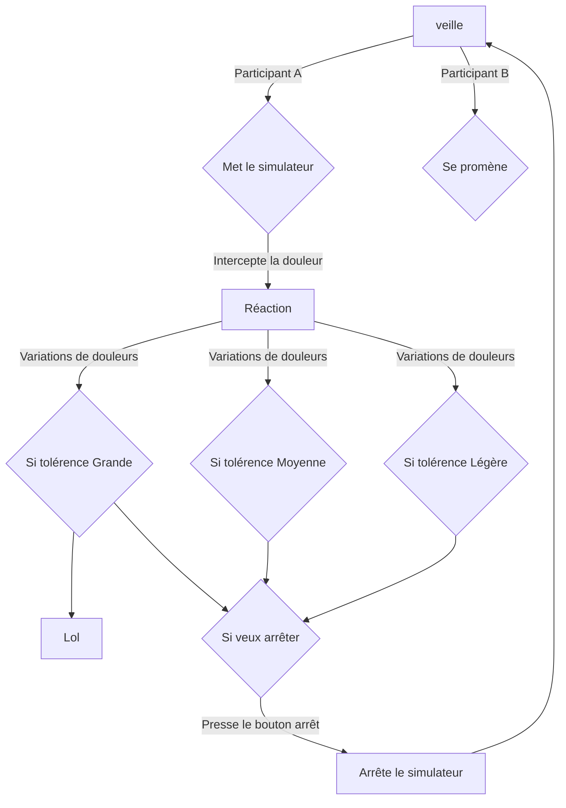

# Ruine

## Idée

### Concept

Une personne est connectée à un simulateur de crampes menstruelles et un capteur de fréquences cardiaque. La douleur reçu va venir changer l'environnement du participant tout selon sa fréquence cardiaque. Les designs graphiques projetés sur le mur, les couleurs et les mouvements sont modifiés tout dépendant des fréquences détectés. Les sons se déforment et se modifis tout selon ce que ressent la personne qui reçoit les légères douleurs. Ce qui rend le tout intéressent c'est que toute personne recevant les douleurs peut réagir différemment et donc intéragir avec la pièce de manière unique, bien sûr, avec certaines limites. De plus, les participants extérieurs (n'aillant pas le simulateur) pourraient avoir contrôle des sons ambiants via un capteur de mouvement, ce qui rajoute du chaos à l'oeuvre. Cela mettrait en lumière l’idée que les douleurs menstruelles sont parfois mal comprises et incontrollables. Le tout deviendra un environnement pour y faire comprendre l'impact nerveux. ¸A tout moment, la personne recevant les crampes pourra arrêter la simulation.

### Objectifs

Le but est de faire comprendre ce qu'une personne **peut ressentir**  autant **physiquement** que **mentalement** en recevant des douleurs menstruelle à chaque mois en **plaçant quelqu'un n'aillant pas de crampes à la place de celle, ou celui, qui en a** à chaque mois et qui doit gérer sa vie en conséquence. Aussi, **ouvrir la parole sur un sujet qui serait tabou.**

### Motivations

- Mon expérience personnelle et celle de mon entourage.
- Le mouvement féministe.
- Le manque d'oeuvres interactives au mouvement féministe (Un domaine majoritèrement homme)
- [Ada x](https://www.ada-x.org/):

>"Ada X est un centre d’artistes féministe bilingue engagé dans l’exploration, la création et la réflexion critique en arts médiatiques et en culture numérique."

## Scénario

https://github.blog/developer-skills/github/include-diagrams-markdown-files-mermaid/

## Ambiance

### Planche d'ambiances visuelles

Moodboard et color palette

### Planche d'ambiances sonores

#### Musique:
- https://www.youtube.com/watch?v=UdKfehqXZc0
- https://www.youtube.com/watch?v=4XeSs9a1rLQ&list=PLBBz6wzKh2tMFQ-kCNZKN96oCJCIcehtk
- https://www.youtube.com/watch?v=Tu0psLnYyW4&list=PLBBz6wzKh2tMFQ-kCNZKN96oCJCIcehtk&index=7
- https://www.youtube.com/watch?v=d7vyEsxvKpQ&list=PLBBz6wzKh2tMFQ-kCNZKN96oCJCIcehtk&index=10
- https://www.youtube.com/watch?v=50UKqoiqf3k&list=PLBBz6wzKh2tMFQ-kCNZKN96oCJCIcehtk&index=11
- https://www.youtube.com/watch?v=3w7ay5LPtOY&list=PLBBz6wzKh2tMFQ-kCNZKN96oCJCIcehtk&index=12

### Références artistiques

#### Exemples d'oeuvres inspirantes faites par des femmes:

- **[Eunoia](https://www.thelisapark.com/work/eunoia)** de [Lisa Park](https://www.thelisapark.com/)

- **[I dream of a soft oasis](https://www.rihabessayh.com/i-dream-of-a-soft-oasis-2022)** de [Rihab Essayh](https://www.rihabessayh.com/)

- **[Freeing the Voice](https://imma.ie/collection/freeing-the-voice/)** de [Marina Abramović](https://fr.wikipedia.org/wiki/Marina_Abramovi%C4%87)

#### Liens d'autres oeuvres multimédias servant d'inspirations au projet:

- [Body Sculptures](https://clotmag.com/body-sculptures/stelarc)
- [PainStation](https://www.youtube.com/watch?v=qMie0he1H7s)
- [Pulse Room](https://www.lozano-hemmer.com/pulse_room.php)
- [Heavy Duty Love for Future Sensitive Humans](https://www.ngv.vic.gov.au/exhibition/lucy-mcrae/)
- [Infinity Room](https://refikanadol.com/works/infinity-room/)
- [Universe of Fire Particles Falling from the Sky](https://www.teamlab.art/ew/universe_fireparticles_falling/planets/)
- [TOUCH](https://studioroosegaarde.net/project/touch)

## Technologies

### Support médiatique

Description des types de médias (vidéo, audio, lumières, capteurs, etc.) et de leur intégration pour créer une expérience immersive. (Ce que je montre pour l'ambiance)

### Matériel

Simulateur de crampes, capteur de fréquences cardiaques, stéréos, projecteur, lumières, cables, une salle, chaise au besoin, clavier et ordi ? timer ? bouton angle pour lvl de douleur ?.

### Logiciels

Arduino, Touch Designer, Reaper, Logic Pro, Max, (Unity, blender si 3D, si utilisation de modèles) ??

## sources

https://www.serwah.xyz/digital-art
https://www.instagram.com/pierrepauze/
https://www.thelisapark.com/work/eunoia
https://www.lozano-hemmer.com/pulse_island.php
https://www.instagram.com/_ng_v/
https://ocula.com/magazine/insights/pain-and-peace-in-michele-chus-installation-art/
https://www.wikiart.org/fr/marina-abramovic
https://fisheyeimmersive.com/article/art-numerique-quand-les-femmes-questionnent-le-sexe/
https://www.ada-x.org/activities/les-larmes-evaporees-des-roses-de-sable-rihab-essayh/
https://www.ada-x.org/activities/htmlles-2024-les-mouvements-qui-nous-sommes-giv/
https://katherinemelancon.com/new-work/
https://htmlles.net/
https://htmlles.net/calendrier/a-nos-protheses/
https://www.ada-x.org/activities/exposition-lorraine-oades/
https://www.youtube.com/watch?v=yQ3vqfdIToo&list=PLUFYSjzJt4pSAkPLRojNrTt6ZOVkDmI2_&index=35
https://www.ada-x.org/activities/unfolding-sequences-ima-pico/
https://www.youtube.com/results?search_query=how+to+use+period+cramp+simulator

https://www.ada-x.org/productions/festival/page/2/
