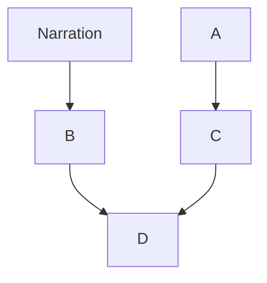
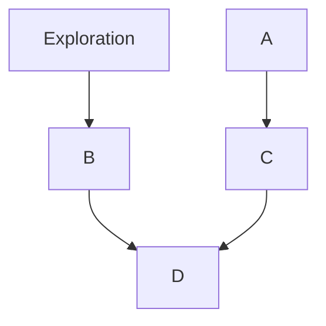

# Ruine

## Idée

### Concept

Une personne est connectée à un simulateur de crampes menstruelles et un capteur de fréquences cardiaque. La douleur reçu, selon la fréquence cardiaque, va venir changer l'environnement du participant tout selon sa fréquence cardiaque. Les designs graphiques projetés sur le mur, les couleurs et les mouvements sont modifiés. Les sons se déforment et se modifis tout selon ce que ressent la personne qui reçoit les légères douleurs. Ce qui rend le tout intéressent c'est que toute personne recevant les douleurs peut réagir différemment et donc intéragir avec la pièce uniquement, bien sûr, avec certaines limites.

### Objectifs

Le but est de faire comprendre à chaque personnes ce qu'une personne **peut concevoir sensoriellement** la douleur menstruelle à chaque mois. **Placer quelqu'un n'aillant pas de crampes à la place de celle, ou celui, qui en a** à chaque mois et qui doit gérer sa vie en conséquence. **Ouvrir la parole sur un sujet qui est tabou.**

### Motivations

Ma vie personelle, les histoires d'autres personnes vivant avec les mêmes problèmes. Les sensations ressentis. Après avoir regardé des vidéos de personnes testant des simulateurs de crampes, l'inspiration m'est venue d'utiliser cette technologie. ??????

## Scénario

### Interactif

### Narratif

### Expérience utilisateur

## Ambiance

### Planche d'ambiances visuelles

Exemples de projets similaires

### Planche d'ambiances sonores

Planche d'ambiance

### Références artistiques

Oeuvres inspirantes.

## Technologies

### Support médiatique

Vidéo, audio, sensoriel interactif ?

### Matériel

Simulateur de crampes, capteur de pouls, stéréos, projecteur, lumières, cables, une salle, chaise au besoin.

### Logiciels

Arduino, Touch Designer, Reaper, Logic Pro, Max, etc..
