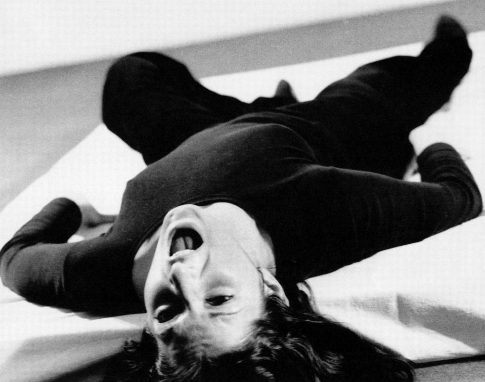
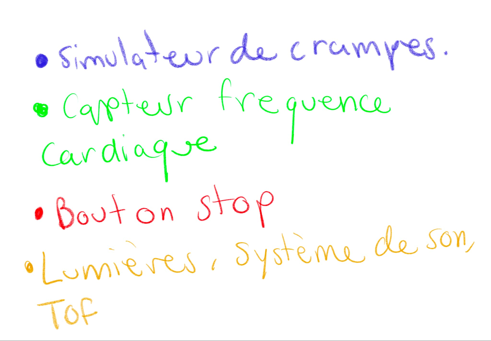
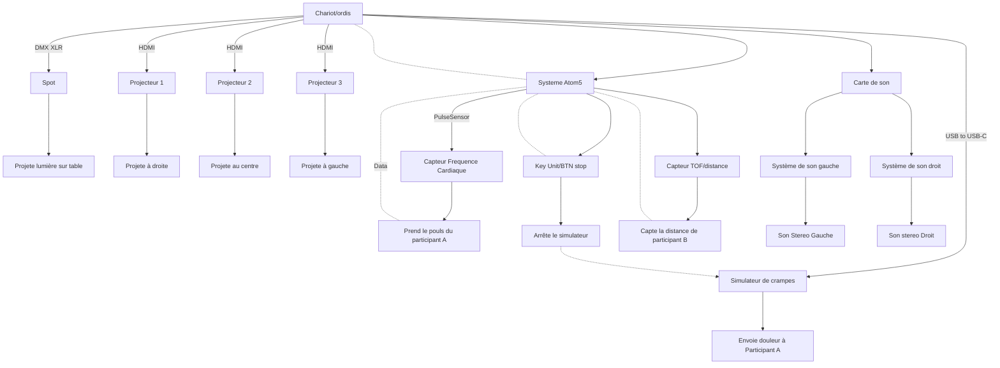

# Ruine

## Idée

### Concept

Une personne est connectée à un simulateur de crampes menstruelles et à un capteur de fréquences cardiaques. La douleur reçue va venir changer l'environnement du participant, tout selon le pouls de celle-ci. Les designs graphiques projetés sur le mur et l'éclairage sont modifiés tout dépendant des fréquences détectées. Ce qui rend le tout intéressant, c'est que toute personne recevant les douleurs peut réagir différemment et donc interagir avec la pièce de manière unique, bien sûr, avec certaines limites. De plus, les participants extérieurs (n'ayant pas le simulateur) pourraient avoir le contrôle des sons ambiants via un capteur de mouvement, ce qui rajoute du chaos à l'oeuvre. Cela mettrait en lumière l’idée que les douleurs menstruelles sont parfois mal comprises et incontrôlables. Le tout deviendra un environnement pour y faire comprendre l'impact nerveux d'une personne souffrante de crampes très douloureuses. À tout moment, la personne recevant les crampes pourra arrêter la simulation à l'aide d'un bouton.

### Objectifs

Le but est de faire comprendre ce qu’une personne aillant des crampes menstruelles ressent à chaques mois, autant physiquement que mentalement. L’idée est de placer quelqu’un qui n’en souffre pas dans la situation de celles et ceux qui en sont affectés. Il s’agit aussi d'**ouvrir la parole sur un sujet qui serait tabou.**.

### Motivations

- Mon expérience personnelle et celle de mon entourage.
- Le mouvement féministe.
- Le manque d'oeuvres interactives au mouvement féministe (Un domaine majoritairement homme).
- Le manque de recherches effectuées pour les cas tels que l'endométriose, le développement de contraceptifs aux symptômes minimisés, et ainsi de suite.
- *Female Rage*
- [Ada x](https://www.ada-x.org/):

>*"Ada X est un centre d’artistes féministe bilingue engagé dans l’exploration, la création et la réflexion critique en arts médiatiques et en culture numérique."*

## Scénario

- Note participant B: Plus il y a de participants B, plus il y a de chaos.

## Ambiance

### Planche d'ambiances visuelles

### Planche d'ambiances sonores

#### Musique:
- [Universe of Fire Particles Falling from the Sky](https://www.youtube.com/watch?v=UdKfehqXZc0)
- [THE DAY WE LEFT FIELD](https://www.youtube.com/watch?v=oZAot9EZFM0&t=1s)
- [Oriens](https://www.youtube.com/watch?v=IC1x9fgReQ0)
- [Behind INEXISTENCE](https://www.youtube.com/watch?v=d7vyEsxvKpQ)
- [Atmospheric Experimental Sound Design](https://www.youtube.com/watch?v=3w7ay5LPtOY)

### Références artistiques

#### Exemples d'oeuvres inspirantes faites par des femmes:

- **[Eunoia](https://www.thelisapark.com/work/eunoia)** de [Lisa Park](https://www.thelisapark.com/)

- **[I dream of a soft oasis](https://www.rihabessayh.com/i-dream-of-a-soft-oasis-2022)** de [Rihab Essayh](https://www.rihabessayh.com/)

- **[Freeing the Voice](https://imma.ie/collection/freeing-the-voice/)** de [Marina Abramović](https://fr.wikipedia.org/wiki/Marina_Abramovi%C4%87)

#### Liens d'autres oeuvres multimédias servant d'inspirations au projet:

- [Machine hallucinations](https://refikanadol.com/works/machine-hallucinations-nature-dreams/) de Refik Anadol
- [Body Sculptures](https://clotmag.com/body-sculptures/stelarc) de STELARC
- [PainStation](https://www.youtube.com/watch?v=qMie0he1H7s) de Volker Morawe et Tilman Reiff
- [Pulse Room](https://www.lozano-hemmer.com/pulse_room.php) de Rafael Lozano-Hemmer
- [Heavy Duty Love for Future Sensitive Humans](https://www.ngv.vic.gov.au/exhibition/lucy-mcrae/) de Lucy McRae
- [Infinity Room](https://refikanadol.com/works/infinity-room/) de Refik Anadol
- [Universe of Fire Particles Falling from the Sky](https://www.teamlab.art/ew/universe_fireparticles_falling/planets/) de Teamlab
- [TOUCH](https://studioroosegaarde.net/project/touch) de Studio Roosegaarde
- [PSYCH.E](https://en.36degres.art/psych-e) exposition expérience mise en place par 36 degrés et la Galerie Charlot

## Technologies

### Support médiatique

- Vidéos interactives, particules 3D de TouchDesigner, modifications à partir des fréquences cardiaques.
- Interactivité sonore, ambiances stéréos, modification à l'aide de capteurs.

### Matériel
- Simulateur de muscles TENS

- Capteur de fréquences cardiaques

- Speakers
- Projecteurs
- Lumières
- Bouton
- Cables
- Ordinateur portable
- Chaise
- Une salle

### Logiciels

|Arduino|TouchDesigner|Reaper|Logic Pro|
|----|----|----|----|
|||||

## Sources

### Recherches pour la conception:
- https://www.serwah.xyz/digital-art
- https://www.thelisapark.com/work/eunoia
- https://www.thelisapark.com/
- https://www.lozano-hemmer.com/pulse_island.php
- https://www.wikiart.org/fr/marina-abramovic
- https://imma.ie/collection/freeing-the-voice/
- https://fisheyeimmersive.com/article/art-numerique-quand-les-femmes-questionnent-le-sexe/
- https://www.ada-x.org/
- https://htmlles.net/
- https://www.ada-x.org/activities/exposition-lorraine-oades/
- https://www.ada-x.org/activities/unfolding-sequences-ima-pico/
- https://www.ada-x.org/activities/pas-dapparat-corps/
- https://www.ada-x.org/activities/les-larmes-evaporees-des-roses-de-sable-rihab-essayh/

### Vidéos pour la conception:

- https://www.youtube.com/watch?v=UdKfehqXZc0
- https://www.youtube.com/watch?v=4XeSs9a1rLQ&list=PLBBz6wzKh2tMFQ-kCNZKN96oCJCIcehtk
- https://www.youtube.com/watch?v=Tu0psLnYyW4&list=PLBBz6wzKh2tMFQ-kCNZKN96oCJCIcehtk&index=7
- https://www.youtube.com/watch?v=d7vyEsxvKpQ&list=PLBBz6wzKh2tMFQ-kCNZKN96oCJCIcehtk&index=10
- https://www.youtube.com/watch?v=50UKqoiqf3k&list=PLBBz6wzKh2tMFQ-kCNZKN96oCJCIcehtk&index=11
- https://www.youtube.com/watch?v=3w7ay5LPtOY&list=PLBBz6wzKh2tMFQ-kCNZKN96oCJCIcehtk&index=12
- https://www.youtube.com/watch?v=PuiWm2Lb-hk
- https://www.youtube.com/watch?v=qMie0he1H7s

# Planification

## Modifications apportés

### Notes

- **Modification** par rapport à la prise de données du participant A: Fréquence cardiaque **prise plus simplement à l'aide d'un kit PulseSensor** et programmation dans Arduino détaillé et documenté. Le participant met le bout de son doigt sur le sensor et ainsi on peut avoir un rate assez précis comme indiqué dans la documentation de leur [site PulseSensor.com](https://pulsesensor.com/).
- 
## Scénarimage

# Légende

## Simulation

## Synoptique

## Plantation

Schéma dessus et tous les côtés

## Devis technique

PDF sur la création d'un système de simulation de crampes menstruelles: chrome-extension://efaidnbmnnnibpcajpcglclefindmkaj/https://www.jstage.jst.go.jp/article/jrobomech/33/5/33_1051/_pdf

Dans le document, Il est expliqué qu'un Power Supply est connecté à un Control Board contrôlé par Arduino, ce control Board est relié par deux electrodes qui envoient des pulsions musculaires au bas ventre et simulent les crampes. Ce système peut aussi être lié à Unity pour coder la puissance électrique.

>The power supply used was P4K36-1 (Matsusada Precision Inc., Japan) with voltage control. The voltage was set to be updated every 0.1 s using the supplied SDK and Unity to change the strength of electrical stimulation.

- Problématiques: très risqué de faire le simulateur pas sois même.
- Solution: Prendre un simulateur déjà existant et trouvé le moyen de utilisé la notion apprise pour recréer cette simulation similaire à l'aide de Unity et Arduino.

## Sécurité

### Réglementations en matière de santé et de sécurité

### Formulaire de consentement

### S'assuré de la santé physique du Participant avant la simulation

### Suivis

### Assurance

### 
